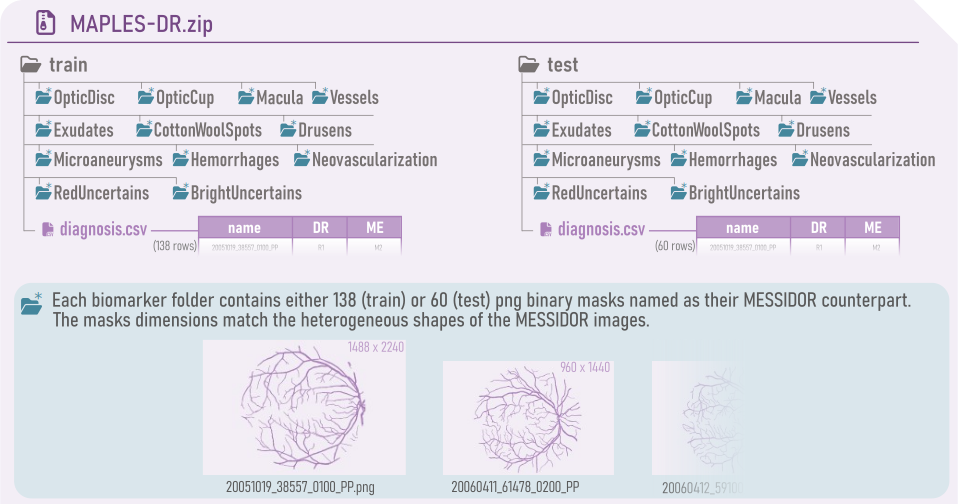

*****************************
MAPLES-DR Dataset Description
*****************************

The  project was originally motivated in 2018 by the absence of large fundus public datasets providing pixel-wise annotations of both anatomical and pathological structures of the retina. Such datasets are especially valuable in a context where the deep learning models which achieved state-of-the-art diagnosis of |DR| were criticized for their lack of explainability or interpretability.

We designed |MAPLES-DR| to address this gap by providing pixel-wise annotations of anatomical structures (optic disc, macula, retinal vessels) and pathological lesions (microaneurysms, hemorrhages, neovascularizations, exudates, cotton wool spots, drusens) for nearly 200 images of the well known `MESSIDOR <https://www.adcis.net/en/third-party/messidor/>`_ public dataset. The annotations were performed by a team of seven senior retinologists from hospitals in Toronto and Montréal (Canada).

|MAPLES-DR| also includes diagnostic for |DR| and |ME| following Canadian teleopthalmology screening guidelines :footcite:`Boucher2020`. These diagnoses are closer to international standards :footcite:`wilkinson2003proposed` :footcite:`zachariah2015grading` than MESSIDOR's original ones.

Labels Description
==================

.. figure:: ../_static/MAPLES-DR_Content_Overview.svg
   :width: 800px
   :align: center

   Overview of MAPLES-DR labels.

Segmentation of Anatomical structures
*************************************
Anatomical structures are present in all images, including healthy ones, but their appearance and their proximity to lesions provide valuable diagnostic information.

**Retinal vessels** are indicative of the stage of |DR|: an increase in arteriolar tortuosity is associated with mild and moderate stages :footcite:`sasongkoRetinalVascularTortuosity2011`, while venous beading and dilation are symptoms of severe proliferative stages. The vascular tree is also used as a reference to assess the readability of an image.

The **optic disc**, **optic cup**, and **macula** are also included in |MAPLES-DR|. Their purpose for diagnosis is two-fold. First, ME is graded by counting the number of lesions within one or two optic disk diameters from the macula, which implies the annotation of both these anatomical structures. Similarly, clinical definitions of |DR| severity often distinguish four quadrants by dividing the retina  horizontally by a line through the fovea and optic disc (superior / inferior division) and vertically by a line through the fovea (temporal / nasal division) :footcite:`purvesRetinotopicRepresentationVisual2001`. Second, the positions of the lesions in relation to these healthy structures may indicate different etiologies and severities. For example, clinical guidelines sometimes distinguish between disc neovascularization and other neovascularization.

Segmentation of Red lesions
***************************
Diabete mellitelus affects the walls of the vessels, eventually causing microvascular dysfunctions that manifest in the retina as microaneurysms, hemorrhages, intraretinal microvascular abnormalities (:abbr:`IRMA (Intra-Retinal Microvascular Abnormalities)`), or neovessels. We refer to these pathological structures as "red lesions". 

**Microaneurysms** appear as small circular dilations of the capillaries. They are early signs of microvascular dysfunction and are commonly used to detect mild |DR|.

Intraretinal **hemorrhages** develop in more advanced stages of the pathology and are divided into dot or blot hemorrhages. Dot hemorrhages appear as circular and well-defined spots and are typically caused by the rupture of a microaneurysm. Distinguishing them from microaneurysms is challenging, and only fundus angiography (FA) can differentiate the two with complete certainty. Blot hemorrhages are larger and have less defined borders. Both were annotated simply as *hemorrhages* in |MAPLES-DR|. Clinical practice also recognizes superficial (flame-shaped) and vitreous hemorrhages that appear in the most severe stages of retinopathy, none was discovered in the MAPLES-DR dataset.

Starting from the moderate non-proliferative stage (R2), irregular intraretinal vessels can appear, referred to as :abbr:`IRMA (Intra-Retinal Microvascular Abnormalities)`. The next stage of the disease (R3) coincides with even more extensive intraretinal changes, which are precursors to worsening of the disease. Indeed, the presence of :abbr:`IRMA (Intra-Retinal Microvascular Abnormalities)` indicates a 50% risk of developing **neovascularisation**  within one year, corresponding to a transition to the proliferative stage of the disease. Leakages from extensive neovascularisation are responsible for preretinal and vitreous hemorrhages that can cause major visual loss. In the fundus image, neovascularisations are difficult to distinguish from :abbr:`IRMA (Intra-Retinal Microvascular Abnormalities)`; however, fluorescein angiography may reveal a leakage that serves as a discriminant factor between the two. In the absence of this imaging modality, :abbr:`IRMA (Intra-Retinal Microvascular Abnormalities)` are not differentiated from neovascularisation in |MAPLES-DR|.

Segmentation of Bright Lesions
******************************
In the severe stages of |DR|, the retina thickens (edema formation) and hard **exudates** (also known as lipoprotein exudation)  may appear, potentially causing loss of visual acuity. These deposits usually arise from leakage from damaged capillaries. Furthermore, in the case of ischemia, one can observe a blockage in axonal transport (the movement of mitochondria, lipids, proteins, and other substances within the neuron's body, allowing for its renewal) in the optic nerve fiber layer. 

This can lead to the appearance of lesions known as **Cotton Wool Spots** (:abbr:`CWS (Cotton Wool Spots)`), resulting from axoplasmic accumulations. They are characterized by their white appearance and blurry borders. While the principal etiology is diabetic retinopathy, :abbr:`CWS (Cotton Wool Spots)` can be observed in other vascular diseases (systemic arterial hypertension, vein obstruction, coagulopathies...) 

Finally, |MAPLES-DR| also provides annotations of **drusens**. These lesions are more commonly associated with Age-related Macular Degeneration (:abbr:`AMD (Age-related Macular Degeneration)`), with a prevalence varying from 10\% (fifth decade of life) to 35\% (seventh decade).  They usually appear around the macula and are histologically situated at the interface with the Retinal Pigment Epithelium (RPE). It is supposed that they originate from degenerative products of the RPE's cells and are composed of lipids and glycoproteins. Classifying early stage :abbr:`AMD (Age-related Macular Degeneration)` depends on  estimating the size of the drusen.

.. _dr-me-grades:

|DR| and |ME| grades
********************

|MAPLES-DR| grades for |DR| and |ME| annotated by the retinologists follow the guidelines developed for Canadian teleopthalmology screening. These guidelines distinguish six grades for |DR|:

 - **R0**: absent
 - **R1**: mild
 - **R2**: moderate
 - **R3**: severe
 - **R4A**: proliferative
 - **R4S**: stable treated proliferative
 - **R6**: insufficient quality for grading
 
and three for ME: 

 - **M0**: absent
 - **M1**: mild
 - **M2**: moderate 
 - **M6**: insufficient quality for grading
 

Grades are defined systematically by the number and position of visible red and bright retinal lesions. Each grade is associated with a recommended course of action (from rescreening in two years for mild cases, to immediate referral to an ophthalmologist for the more severe ones). 

A detailed definition of the grading system can be found in `this paper <http://doi.org/10.1016/j.jcjo.2020.01.001>`_ :footcite:`Boucher2020`.

Data Records
============

.. |MAPLES-DR.zip| replace:: ``MAPLES-DR.zip``
.. _MAPLES-DR.zip: https://figshare.com/articles/dataset/_b_MAPLES-DR_b_MESSIDOR_Anatomical_and_Pathological_Labels_for_Explainable_Screening_of_Diabetic_Retinopathy/24328660?file=43695816
.. |AdditionalData.zip| replace:: ``AdditionalData.zip``
.. _AdditionalData.zip: https://figshare.com/articles/dataset/_b_MAPLES-DR_b_MESSIDOR_Anatomical_and_Pathological_Labels_for_Explainable_Screening_of_Diabetic_Retinopathy/24328660?file=43695822

|MAPLES-DR| dataset is distributed as two archives: |MAPLES-DR.zip|_ and |AdditionalData.zip|_. The first one contains the main data of MAPLES-DR (segmentation maps and grades), while the second one contains additional information on the annotation processes (time to complete, comments) as well as intermediate data (pre-annotation maps, grades before consensus...). 

MAPLES-DR.zip
*************

|MAPLES-DR.zip|_ is the main archive of the dataset. It's split into two folders `train/` and `test/`, each one containing a table `diagnosis.csv` with the final |DR| and |ME| grades as well as 12 folders: one for each biomarker. Those folders store the segmentation maps as png binary images following the same naming convention as their MESSIDOR counterparts (eg. `20051019_38557_0100_PP.png`). The train set is composed of 138 images, while the test set contains 60 images.

The segmentation maps were resized to match the resolution of the original MESSIDOR images. Note that the MESSIDOR images vary in dimensions (ranging from 960x1440 up to 1536x2304 pixels), thus do the images in |MAPLES-DR.zip|_.

   Overview of the main |MAPLES-DR| archive: |MAPLES-DR.zip|_.

AdditionalData.zip
******************

The second archive contains all the additional information and data collected during the annotation process. It's also the only archive downloaded and used by the :doc:`maples_dr <python_library>` library. Indeed because |AdditionalData.zip|_ includes all the annotations and pre-annotation in the resolution at which they were annotated (1500x1500 pixels), as well as the individual diagnoses graded by each retinologist, all the data contained in the |MAPLES-DR.zip|_ can be derived from it.   

It contains the following files:

- **biomarkers_annotations_infos.xls**: identify which ``Retinologist`` performed the annotation of a given biomarker category, the ``Time`` spent on each annotation (in seconds), any ``Comment`` they left, and the ``Annotation#`` rank (1 for the first image annotated, 200 for the last).
- **diagnosis_infos.xls**: contains the grades of |DR| and |ME| annotated by each Retinologist as well as the consensus they reached. It also includes the  comments left by the retinologists while grading.
- **MESSIDOR-ROIs.csv**: provides the bounding boxes extracted from the MESSIDOR images to obtain squared regions of interest without blank borders. The bounding boxes are stored as top-left (``x0``, ``y0``) and bottom-right (``x1``, ``y1``) coordinates in pixels. This file also includes the original resolution in pixel of the MESSIDOR images: ``H`` and ``W`` (resp. height and width).
- **dataset_record.yaml**: a yaml file containing the ``biomarkers`` name, the ``test`` and ``train`` split (as a list of image name), and the names of the ``duplicates`` associated to the names of their "siblings" in |MAPLES-DR| train set.
- **annotations/**: this folder has 12 subfolders (one for each biomarker), which in turn contains all 200 segmentation maps annotated by the retinologists (train, test and duplicates). The images are stored as png binary masks in the resolution at which they were annotated (1500x1500 pixels) using the ROIs provided in the ``MESSIDOR-ROIs.csv``.
- **pre_annotations/**: this folder contains the automatic segmentation of Vessels, Exudates, Hemorrhages, and Microaneurysms provided as pre-annotations to the retinologists.

   Overview of the additional archive: |AdditionalData.zip|_.

.. note:: 
   **Note on the duplicates**: initially 200 images were annotated but we latter realized that two of them were duplicates from the original MESSIDOR dataset (the same images stored different names). The 2 duplicates were removed from |MAPLES-DR.zip|_ but were kept in |AdditionalData.zip|_ for transparency.

Annotation Procedure
====================
The annotation procedure was co-designed with the team of retinologists to meet a triple objective:

 1. Providing an intuitive yet effective annotation tool for the classification and segmentation of biomarkers in fundus images. 
 2. Enabling a collaborative effort on common annotations despite the geographical distance between the retinologists and the limited time each could dedicate to this program. 
 3. Designing a "scalable" annotation protocol, capable of being extended to much more ambitious annotation campaigns, such as labeling large Canadian telemedicine databases containing tens of thousands of images.

To meet these challenges, we developed a custom web-based annotation platform allowing the following workflow: expert annotators can access the Web portal at any time to consult and edit annotations with specialized drawing tools; these annotations and the related information (annotation times, comments) are centralized and stored in a secure database hosted on our laboratory server; as the research team, we assign tasks to annotators, monitor progress, and export annotations via a Python API. The annotation platform (portal, annotation tools, server backend, and Python API) as well as training material for annotators is available on `GitHub <https://github.com/LIV4D/AnnotationPlatform>`_.

For more details on the annotation process please refer to the `MAPLES-DR paper <https://arxiv.org/abs/2402.04258>`_ :footcite:`maples_dr`.

References
==========
.. footbibliography::
